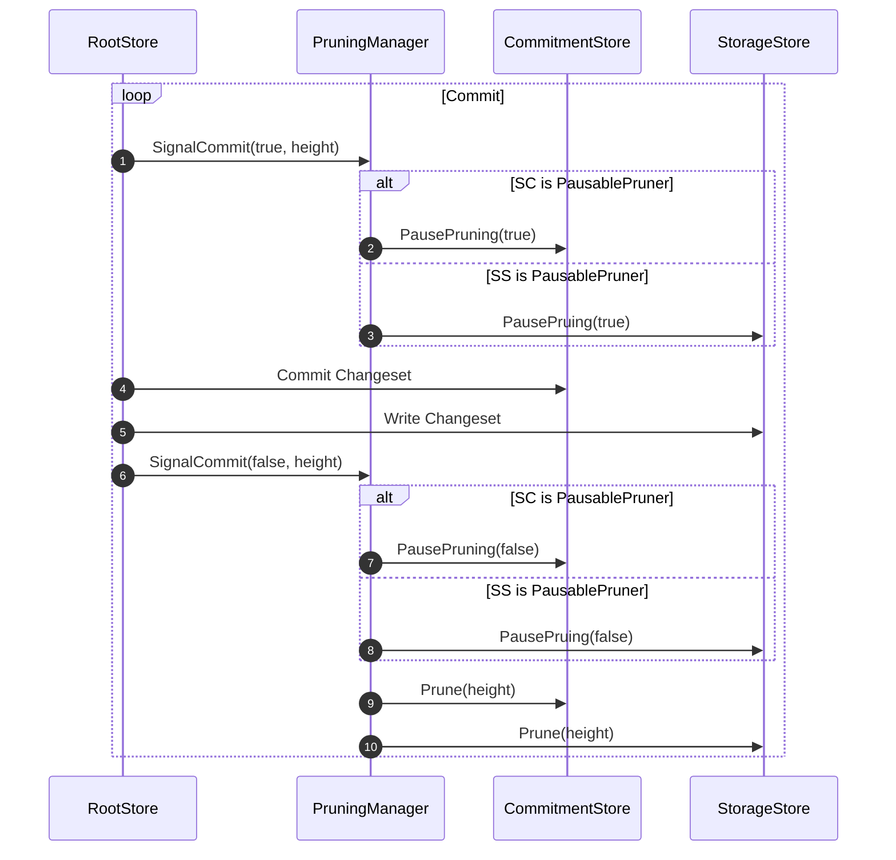

# Pruning Manager

The `pruning` package defines the `PruningManager` struct which is responsible for
pruning the state storage (SS) and the state commitment (SC) based on the current
height of the chain. The `PruningOption` struct defines the configuration for pruning
and is passed to the `PruningManager` during initialization.

## Prune Options

The `PruningOption` struct includes the following fields:

* `KeepRecent` (uint64): The number of recent heights to keep in the state.
* `Interval` (uint64): The interval of how often to prune the state. 0 means no pruning.

## Pausable Pruner

The `PausablePruner` interface defines the `PausePruning` method, which is used to pause
the pruning process. The `PruningManager` will check if the pruner is a `PausablePruner`
and call the `PausePruning` method before and after `Commit` to pause and resume pruning.
This is useful for when the pruning process is asynchronous and needs to be paused during
a commit to prevent parallel writes.

## Pruning Flow

