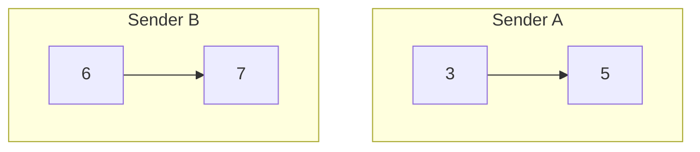

# Priority sender-nonce mempool specification

[priorityNonceMempool](./priority_nonce.go) defines a mempool implementation which stores txs in a partially
ordered set by 2 dimensions: priority, and sender-nonce (sequence number). Internally it uses one priority
ordered skip list and one skip list per sender ordered by sender-nonce (sequence number). When there are
multiple txs from the same sender, they are not always comparable by priority to other sender txs and must be
partially ordered by both sender-nonce and priority.

The follow rules are strictly observed while iterating the mempool to select transactions:

1) For a given sender their txs must be selected in nonce (sequence number) order. 
2) A transaction with a higher priority is always selected before a transaction with a lower priority except
   when to do so would violoate sender-nonce order.

The observance of these rules leads to many interesting cases some of which are outlined below to give an
impression of the prioritization behavior of this mempool.

