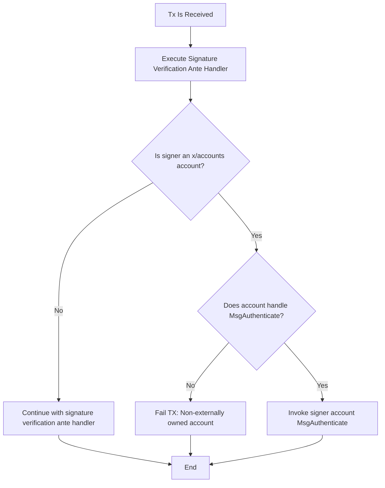

# x/accounts Module

The x/accounts module enhances the Cosmos SDK by providing tools and infrastructure for creating advanced smart accounts.

# The Authentication Interface

x/accounts introduces the `Authentication` interface, allowing for flexible transaction (TX) authentication beyond traditional public key cryptography.

Chain developers can implement tailored authentication methods for their accounts. Any account that implements the `Authentication` interface can be authenticated within a transaction.

To implement the `Authentication` interface in x/accounts, an account must expose an execution handler capable of processing a specific message type.

The key message type for authentication is `MsgAuthenticate`, which is defined in the module's protocol buffer files:

[interfaces/account_abstraction/v1/interface.proto](./proto/cosmos/accounts/interfaces/account_abstraction/v1/interface.proto)

## Authentication Mechanism

### AnteHandler in the SDK

The Cosmos SDK utilizes an `AnteHandler` to verify transaction (TX) integrity. Its primary function is to ensure that the messages within a transaction are correctly signed by the purported sender.

### Authentication Flow for x/accounts Module

When the `AnteHandler` identifies that a message sender (and transaction signer) belongs to the x/accounts module, it delegates the authentication process to that module.

#### Authentication Interface Requirement

For successful authentication, the account must implement the `Authentication` interface. If an account fails to implement this interface, it's considered non-externally owned, resulting in transaction rejection.

##### Sequence Diagram




## Implementing the Authentication Interface

To implement the Authentication interface, an account must handle the execution of `MsgAuthenticate`. Here's an example of how to do this:

```go
package base

import (
   "context"
   "errors"
   aa_interface_v1 "github.com/cosmos/cosmos-sdk/x/accounts/interfaces/account_abstraction/v1"
   "github.com/cosmos/cosmos-sdk/x/accounts/std"
)

// Account represents a base account structure
type Account struct {
   // Account fields...
}

// Authenticate implements the authentication flow for an abstracted base account.
func (a Account) Authenticate(ctx context.Context, msg *aa_interface_v1.MsgAuthenticate) (*aa_interface_v1.MsgAuthenticateResponse, error) {
   if !accountstd.SenderIsAccountsModule(ctx) {
      return nil, errors.New("unauthorized: only accounts module is allowed to call this")
   }
   // Implement your authentication logic here
   // ...
   return &aa_interface_v1.MsgAuthenticateResponse{}, nil
}

// RegisterExecuteHandlers registers the execution handlers for the account.
func (a Account) RegisterExecuteHandlers(builder *accountstd.ExecuteBuilder) {
   accountstd.RegisterExecuteHandler(builder, a.SwapPubKey) // Other handlers
   accountstd.RegisterExecuteHandler(builder, a.Authenticate) // Implements the Authentication interface
}
```

### Key Implementation Points

1. **Sender Verification**: Always verify that the sender is the x/accounts module. This prevents unauthorized accounts from triggering authentication.
2. **Authentication Safety**: Ensure your authentication mechanism is secure:
   - Prevent replay attacks by making it impossible to reuse the same action with the same signature.


#### Implementation example

Please find an example [here](./defaults/base/account.go).

# Supporting Custom Accounts in the x/auth gRPC Server

## Overview

The x/auth module provides a mechanism for custom account types to be exposed via its `Account` and `AccountInfo` gRPC
queries. This feature is particularly useful for ensuring compatibility with existing wallets that have not yet integrated 
with x/accounts but still need to parse account information post-migration.

## Implementation

To support this feature, your custom account type needs to implement the `auth.QueryLegacyAccount` handler. Here are some important points to consider:

1. **Selective Implementation**: This implementation is not required for every account type. It's only necessary for accounts you want to expose through the x/auth gRPC `Account` and `AccountInfo` methods.
2. **Flexible Response**: The `info` field in the `QueryLegacyAccountResponse` is optional. If your custom account cannot be represented as a `BaseAccount`, you can leave this field empty.

## Example Implementation

A concrete example of implementation can be found in `defaults/base/account.go`. Here's a simplified version:

```go
func (a Account) AuthRetroCompatibility(ctx context.Context, _ *authtypes.QueryLegacyAccount) (*authtypes.QueryLegacyAccountResponse, error) {
    seq := a.GetSequence()
    num := a.GetNumber()
    address := a.GetAddress()
    pubKey := a.GetPubKey()

    baseAccount := &authtypes.BaseAccount{
        AccountNumber: num,
        Sequence:      seq,
        Address:       address,
    }

    // Convert pubKey to Any type
    pubKeyAny, err := gogotypes.NewAnyWithValue(pubKey)
    if err != nil {
        return nil, err
    }
    baseAccount.PubKey = pubKeyAny

    // Convert the entire baseAccount to Any type
    accountAny, err := gogotypes.NewAnyWithValue(baseAccount)
    if err != nil {
        return nil, err
    }

    return &authtypes.QueryLegacyAccountResponse{
        Account: accountAny,
        Info:    baseAccount,
    }, nil
}
```

## Usage Notes

* Implement this handler only for account types you want to expose via x/auth gRPC methods.
* The `info` field in the response can be nil if your account doesn't fit the `BaseAccount` structure.

# Genesis

## Creating accounts on genesis

In order to create accounts at genesis, the `x/accounts` module allows developers to provide
a list of genesis `MsgInit` messages that will be executed in the `x/accounts` genesis flow.

The init messages are generated offline. You can also use the following CLI command to generate the
json messages: `simd accounts tx init [account type] [msg] --from me --genesis`. This will generate 
a jsonified init message wrapped in an x/accounts `MsgInit`.

This follows the same initialization flow and rules that would happen if the chain is running. 
The only concrete difference is that this is happening at the genesis block.

For example, given the following `genesis.json` file:

```json
{
  "app_state": {
    "accounts": {
      "init_account_msgs": [
        {
          "sender": "account_creator_address",
          "account_type": "lockup",
          "message": {
            "@type": "cosmos.accounts.defaults.lockup.MsgInitLockupAccount",
            "owner": "some_owner",
            "end_time": "..",
            "start_time": ".."
          },
          "funds": [
            {
              "denom": "stake",
              "amount": "1000"
            }
          ]
        }
      ]
    }
  }
}
```

The accounts module will run the lockup account initialization message.
