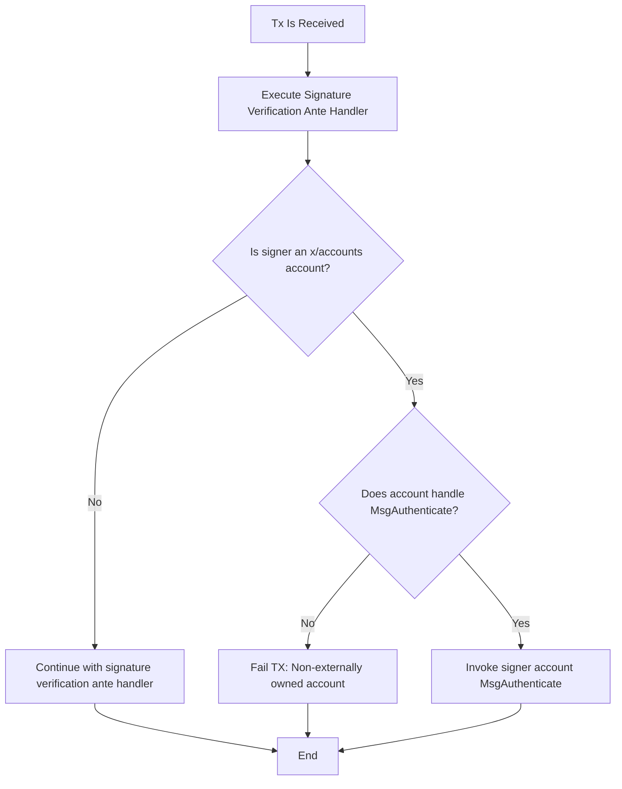

# x/accounts Module

The x/accounts module enhances the Cosmos SDK by providing tools and infrastructure for creating advanced smart accounts.

# Basics

An account can be thought of as a simplified cosmos-sdk module that supports multiple deployments. This means:

1. A single account implementation can be deployed to multiple addresses, similar to how CosmWasm allows multiple contract instances from one WASM upload.

2. Each account address is mapped to its corresponding account code.

3. Accounts maintain their own state partition, similar to modules.

4. Accounts can define both message and query handlers.

This design allows for flexible and reusable account structures within the ecosystem.

## Example account creation

### Basic

Defining an account begins with creating a struct that encapsulates the account's state. If the account has no state, the
struct is empty `type Account struct{}`.

By default, accounts utilize collections to manage their state.

#### State Isolation

It's crucial to understand that an account's state is isolated. This means:

1. States are not shared between accounts of different types.
2. States are not shared even between accounts of the same type.

For example, consider two accounts of type Counter:
- One located at address "cosmos123"
- Another at address "cosmos456"

These accounts do not share the same collections.Item instance. Instead, each maintains its own separate state.

```go
type Account struct {
	// We will define that the account contains in its state a counter, it's an item.
	// It could also be a map or whatever!
	Counter collections.Item[uint64]
}
```

### Init

Creating an account begins with defining its init message. This message is processed when an account is created, similar to:
- The `instantiate` method in a CosmWasm contract
- The `constructor` in an EVM contract

For an account to be a valid `x/account` implementer, it must define both:
1. An `Init` method
2. An init message

We start by defining the `MsgInit` and its corresponding `MsgInitResponse` as protobuf messages:

```protobuf
message MsgInit {
   uint64 counter = 1;
}

message MsgInitResponse {}
```

Next, we implement the Init method, which sets the initial counter. We also implement a method of the `Account` interface. This method:

Signals to the x/accounts runtime what the Init entrypoint is
Performs some generic operations to maintain type safety in the system

Here's the Go implementation:

```go
package counter

import (
    "context"
    "cosmossdk.io/x/accounts/accountstd"
)

type Account struct {
    Counter collections.Item[uint64]
}

func (a Account) Init(ctx context.Context, msg *MsgInit) (*MsgInitResponse, error) {
    err := a.Counter.Set(ctx, msg.Counter)
    if err != nil {
        return nil, err
    }
    
    return &MsgInitResponse{}, nil
}

func (a Account) RegisterInitHandler(builder *accountstd.InitBuilder) {
    accountstd.RegisterInitHandler(builder, a.Init)
}
```

### Execute Handlers

Execute handlers are methods that an account can execute, defined as messages. These executions can be triggered:
- During block execution (not queries) through transactions
- During begin or end block

To define an execute handler, we start by creating its proto message:

```protobuf
message MsgIncreaseCounter {
   uint64 amount = 1;
}

message MsgIncreaseCounterResponse {
   uint64 new_value = 1;
}
```

Next, we implement the handling code for this message and register it using the `RegisterExecuteHandlers` method:

```go
package counter

import (
    "context"
    "cosmossdk.io/x/accounts/accountstd"
)

type Account struct {
    Counter collections.Item[uint64]
}

func (a Account) Init(ctx context.Context, msg *MsgInit) (*MsgInitResponse, error) {
    err := a.Counter.Set(ctx, msg.Counter)
    if err != nil {
        return nil, err
    }
    return &MsgInitResponse{}, nil
}

// Handler for MsgIncreaseCounter
func (a Account) IncreaseCounter(ctx context.Context, msg *MsgIncreaseCounter) (*MsgIncreaseCounterResponse, error) {
    counter, err := a.Counter.Get(ctx)
    if err != nil {
        return nil, err
    }
    
    newValue := counter + msg.Amount
    err = a.Counter.Set(ctx, newValue)
    if err != nil {
        return nil, err
    }
    
    return &MsgIncreaseCounterResponse{NewValue: newValue}, nil
}

// Registration of the handler in the runtime
func (a Account) RegisterExecuteHandlers(builder *accountstd.ExecuteBuilder) {
    accountstd.RegisterExecuteHandler(builder, a.IncreaseCounter)
}

func (a Account) RegisterInitHandler(builder *accountstd.InitBuilder) {
    accountstd.RegisterInitHandler(builder, a.Init)
}
```

This implementation defines an IncreaseCounter method that handles the MsgIncreaseCounter message, updating the counter
value and returning the new value in the response.

### Query Handlers

Query Handlers are read-only methods implemented by an account to expose information about itself. This information can be accessed by:
- External clients (e.g., CLI, wallets)
- Other modules and accounts within the system

Query handlers can be invoked:
1. By external clients
2. During block execution

To define a query handler, we follow a similar process to execute handlers:

1. Define the request and response proto messages:

```protobuf
message QueryCounter {}

message QueryCounterResponse {
   uint64 value = 1;
}
```

2. Implement and register the query handler:

```go
package counter

import (
    "context"
    "cosmossdk.io/x/accounts/accountstd"
)

func (a Account) QueryCounter(ctx context.Context, _ *QueryCounterRequest) (*QueryCounterResponse, error) {
    counter, err := a.Counter.Get(ctx)
    if err != nil {
        return nil, err
    }
    return &QueryCounterResponse{
        Value: counter,
    }, nil
}

func (a Account) RegisterQueryHandlers(builder *accountstd.QueryBuilder) {
    accountstd.RegisterQueryHandler(builder, a.QueryCounter)
}
```

This implementation defines a `QueryCounter` method that retrieves the current counter value and returns it in the response.
The `RegisterQueryHandlers` method registers this query handler with the system.

### The Account constructor

What we have created so far is a super simple basic account, which acts as a counter, now we create an account constructor 
function.

```go
package counter

import (
   "cosmossdk.io/collections"
   "cosmossdk.io/x/accounts/accountstd"
)

var CounterPrefix = collections.NewPrefix(1)

func NewAccount(deps accountstd.Dependencies) (Account, error) {
   return Account{
      Counter:        collections.NewItem(deps.SchemaBuilder, CounterPrefix, "counter", collections.Uint64Value),
   }, nil
}

type Account struct {
   //
}

// the code of the exampl above...
```

The `accounstd.Dependencies` type contains an environment populated with things like `AddressCodec`, `SchemaBuilder` 
(note you do not need to build it, the accounts module will do it for you), `HeaderService`, etc.

# App Wiring

NOTE: assumes you have wired the `x/accounts` module in your application already. If you have not, follow the example
in Simapp.

Now that we have created our basic account, we can wire it to the `x/accounts` module.

## Depinject

We can do it using depinject, you would define the depinject constructor:

```go
package counterdepinject

func ProvideAccount() accountstd.DepinjectAccount {
	return accountstd.DIAccount("counter", counter.NewAccount)
}
```

And then add this to the application:

```go
package app

func NewApp() *App {
	...
   appConfig = depinject.Configs(
      AppConfig(),
      depinject.Supply(
         // supply the application options
         appOpts,
         // supply the logger
         logger,
      ),
      depinject.Provide(
         // inject desired account types:
         counterdepinject.ProvideAccount,
      ),
   )
   ...
}
```

## Manual

## Initting the Account with CLI

Now that we have wired the counter, let's see how we can initialize it.


## Interfaces as messages and queries

## Full Examples

Some examples can be found in the [defaults](./defaults) package.

# The Authentication Interface

x/accounts introduces the `Authentication` interface, allowing for flexible transaction (TX) authentication beyond traditional public key cryptography.

Chain developers can implement tailored authentication methods for their accounts. Any account that implements the `Authentication` interface can be authenticated within a transaction.

To implement the `Authentication` interface in x/accounts, an account must expose an execution handler capable of processing a specific message type.

The key message type for authentication is `MsgAuthenticate`, which is defined in the module's protocol buffer files:

[interfaces/account_abstraction/v1/interface.proto](./proto/cosmos/accounts/interfaces/account_abstraction/v1/interface.proto)

## Authentication Mechanism

### AnteHandler in the SDK

The Cosmos SDK utilizes an `AnteHandler` to verify transaction (TX) integrity. Its primary function is to ensure that the messages within a transaction are correctly signed by the purported sender.

### Authentication Flow for x/accounts Module

When the `AnteHandler` identifies that a message sender (and transaction signer) belongs to the x/accounts module, it delegates the authentication process to that module.

#### Authentication Interface Requirement

For successful authentication, the account must implement the `Authentication` interface. If an account fails to implement this interface, it's considered non-externally owned, resulting in transaction rejection.

##### Sequence Diagram




## Implementing the Authentication Interface

To implement the Authentication interface, an account must handle the execution of `MsgAuthenticate`. Here's an example of how to do this:

```go
package base

import (
   "context"
   "errors"
   aa_interface_v1 "github.com/cosmos/cosmos-sdk/x/accounts/interfaces/account_abstraction/v1"
   "github.com/cosmos/cosmos-sdk/x/accounts/std"
)

// Account represents a base account structure
type Account struct {
   // Account fields...
}

// Authenticate implements the authentication flow for an abstracted base account.
func (a Account) Authenticate(ctx context.Context, msg *aa_interface_v1.MsgAuthenticate) (*aa_interface_v1.MsgAuthenticateResponse, error) {
   if !accountstd.SenderIsAccountsModule(ctx) {
      return nil, errors.New("unauthorized: only accounts module is allowed to call this")
   }
   // Implement your authentication logic here
   // ...
   return &aa_interface_v1.MsgAuthenticateResponse{}, nil
}

// RegisterExecuteHandlers registers the execution handlers for the account.
func (a Account) RegisterExecuteHandlers(builder *accountstd.ExecuteBuilder) {
   accountstd.RegisterExecuteHandler(builder, a.SwapPubKey) // Other handlers
   accountstd.RegisterExecuteHandler(builder, a.Authenticate) // Implements the Authentication interface
}
```

### Key Implementation Points

1. **Sender Verification**: Always verify that the sender is the x/accounts module. This prevents unauthorized accounts from triggering authentication.
2. **Authentication Safety**: Ensure your authentication mechanism is secure:
   - Prevent replay attacks by making it impossible to reuse the same action with the same signature.


#### Implementation example

Please find an example [here](./defaults/base/account.go).

# Supporting Custom Accounts in the x/auth gRPC Server

## Overview

The x/auth module provides a mechanism for custom account types to be exposed via its `Account` and `AccountInfo` gRPC
queries. This feature is particularly useful for ensuring compatibility with existing wallets that have not yet integrated 
with x/accounts but still need to parse account information post-migration.

## Implementation

To support this feature, your custom account type needs to implement the `auth.QueryLegacyAccount` handler. Here are some important points to consider:

1. **Selective Implementation**: This implementation is not required for every account type. It's only necessary for accounts you want to expose through the x/auth gRPC `Account` and `AccountInfo` methods.
2. **Flexible Response**: The `info` field in the `QueryLegacyAccountResponse` is optional. If your custom account cannot be represented as a `BaseAccount`, you can leave this field empty.

## Example Implementation

A concrete example of implementation can be found in `defaults/base/account.go`. Here's a simplified version:

```go
func (a Account) AuthRetroCompatibility(ctx context.Context, _ *authtypes.QueryLegacyAccount) (*authtypes.QueryLegacyAccountResponse, error) {
    seq := a.GetSequence()
    num := a.GetNumber()
    address := a.GetAddress()
    pubKey := a.GetPubKey()

    baseAccount := &authtypes.BaseAccount{
        AccountNumber: num,
        Sequence:      seq,
        Address:       address,
    }

    // Convert pubKey to Any type
    pubKeyAny, err := gogotypes.NewAnyWithValue(pubKey)
    if err != nil {
        return nil, err
    }
    baseAccount.PubKey = pubKeyAny

    // Convert the entire baseAccount to Any type
    accountAny, err := gogotypes.NewAnyWithValue(baseAccount)
    if err != nil {
        return nil, err
    }

    return &authtypes.QueryLegacyAccountResponse{
        Account: accountAny,
        Info:    baseAccount,
    }, nil
}
```

## Usage Notes

* Implement this handler only for account types you want to expose via x/auth gRPC methods.
* The `info` field in the response can be nil if your account doesn't fit the `BaseAccount` structure.

# Genesis

## Creating accounts on genesis

In order to create accounts at genesis, the `x/accounts` module allows developers to provide
a list of genesis `MsgInit` messages that will be executed in the `x/accounts` genesis flow.

The init messages are generated offline. You can also use the following CLI command to generate the
json messages: `simd accounts tx init [account type] [msg] --from me --genesis`. This will generate 
a jsonified init message wrapped in an x/accounts `MsgInit`.

This follows the same initialization flow and rules that would happen if the chain is running. 
The only concrete difference is that this is happening at the genesis block.

For example, given the following `genesis.json` file:

```json
{
  "app_state": {
    "accounts": {
      "init_account_msgs": [
        {
          "sender": "account_creator_address",
          "account_type": "lockup",
          "message": {
            "@type": "cosmos.accounts.defaults.lockup.MsgInitLockupAccount",
            "owner": "some_owner",
            "end_time": "..",
            "start_time": ".."
          },
          "funds": [
            {
              "denom": "stake",
              "amount": "1000"
            }
          ]
        }
      ]
    }
  }
}
```

The accounts module will run the lockup account initialization message.
