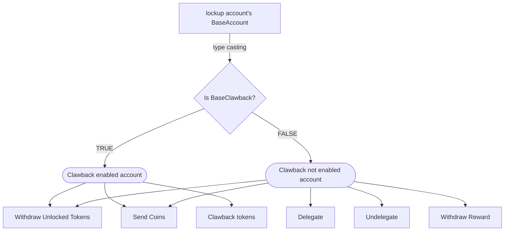
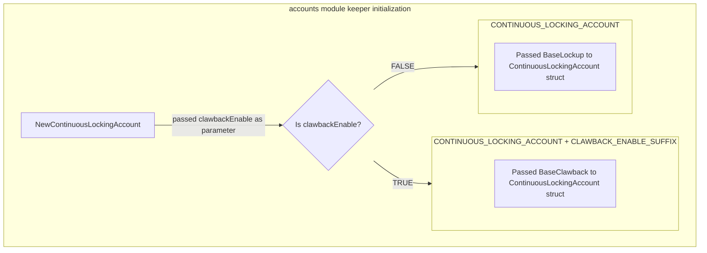

# Lockup Accounts


* [Lockup Account Types](#lockup-account-types)
    * [BaseLockup](#baselockup)
    * [ContinuousLockup](#continuouslockup)
    * [DelayedLockup](#delayedlockup)
    * [PeriodicLockup](#periodiclockup)
    * [PermanentLocked](#permanentlocked)
* [Genesis Initialization](#genesis-initialization)
* [Examples](#examples)
    * [Simple](#simple)
    * [Slashing](#slashing)
    * [Periodic Lockup](#periodic-lockup)

The x/accounts/defaults/lockup module provides the implementation for lockup accounts within the x/accounts module.

## Lockup Account Types

### BaseAccount

All current lockup account types must pass in a `BaseAccount` interface as their property. `BaseAccount` interface is defined as:

```go
type BaseAccount interface {
	Init(ctx context.Context, msg *MsgInitLockupAccount, amount sdk.Coins) (*MsgInitLockupAccountResponse, error)
	SendCoins(ctx context.Context, msg *MsgSend, getLockedCoinsFunc GetLockedCoinsFunc) (*MsgExecuteMessagesResponse, error)
	WithdrawUnlockedCoins(ctx context.Context, msg *MsgWithdraw, getLockedCoinsFunc GetLockedCoinsFunc) (*MsgWithdrawResponse, error)
	QueryAccountBaseInfo(ctx context.Context, req *QueryLockupAccountInfoRequest) (*QueryLockupAccountInfoResponse, error)

	GetEndTime() collections.Item[time.Time]
	GetHeaderService() header.Service
	GetOriginalFunds() collections.Map[string, math.Int]
}
```

### BaseLockup

The base lockup account is used by all lockup accounts that are not clawback enabled. It contains the basic information for a lockup account. The Base lockup account keeps knowledge of the staking delegations from the account. The BaseLockup implemented BaseAccount interface. 

```go
type BaseLockup struct {
	// Owner is the address of the account owner.
	Owner            collections.Item[[]byte]
	OriginalLocking  collections.Map[string, math.Int]
	DelegatedFree    collections.Map[string, math.Int]
	DelegatedLocking collections.Map[string, math.Int]
	WithdrawedCoins  collections.Map[string, math.Int]
	addressCodec     address.Codec
	headerService    header.Service
	// lockup end time.
	EndTime collections.Item[time.Time]
}
```


### BaseClawback

The base clawback account is used by all lockup accounts that are clawback enable. Like base lockup it contains the basic information for a lockup account. The Base clawback account keeps knowledge of the admin of the account, the admin is the wallet that will be able to trigger a clawback execution to claw the remain locked token in the lockup account. The BaseLBaseClawbackockup implemented BaseAccount interface. 

```go
type BaseClawback struct {
	// Owner is the address of the account owner.
	Owner collections.Item[[]byte]
	// Admin is the address who have ability to request lockup account
	// to return the funds
	Admin           collections.Item[[]byte]
	OriginalVesting collections.Map[string, math.Int]
	WithdrawedCoins collections.Map[string, math.Int]
	addressCodec    address.Codec
	headerService   header.Service
	// lockup end time.
	EndTime collections.Item[time.Time]
}
```

### Clawback enabled vs disabled

Clawback enabled lockup account will be able to trigger a clawback execution by the admin to claw the remain locked token in the lockup account. Other execution still need to be triggered by the account owner.

If an lockup account is clawback enable, it will not be able to perform action such as: delegate, undelegate, withdrawReward. 



### How to enable clawback

accounts module keeper takes multiple AccountCreatorFunc as parameter, each represents an account type.

```go
func NewKeeper(
	cdc codec.Codec,
	env appmodule.Environment,
	addressCodec address.Codec,
	ir InterfaceRegistry,
	accounts ...accountstd.AccountCreatorFunc,
) (Keeper, error) {...}
```

All lockup account type AccountCreatorFunc accept a boolean typed flag named clawbackEnable, if true the BaseClawback will be passed as BaseAccount and account type name with additional CLAWBACK_ENABLE_SUFFIX else BaseLockup will be passed in instead and account type name will be kept as default.

Example, in ContinuousLockingAccount:

```go
func NewContinuousLockingAccount(clawbackEnable bool) accountstd.AccountCreatorFunc {
	return func(d accountstd.Dependencies) (string, accountstd.Interface, error) {
		if clawbackEnable {
			baseClawback := newBaseClawback(d)

			return types.CONTINUOUS_LOCKING_ACCOUNT + types.CLAWBACK_ENABLE_SUFFIX, ContinuousLockingAccount{
				BaseAccount: baseClawback,
				StartTime:   collections.NewItem(d.SchemaBuilder, types.StartTimePrefix, "start_time", collcodec.KeyToValueCodec[time.Time](sdk.TimeKey)),
			}, nil
		}

		baseLockup := newBaseLockup(d)
		return types.CONTINUOUS_LOCKING_ACCOUNT, ContinuousLockingAccount{
			BaseAccount: baseLockup,
			StartTime:   collections.NewItem(d.SchemaBuilder, types.StartTimePrefix, "start_time", collcodec.KeyToValueCodec[time.Time](sdk.TimeKey)),
		}, nil
	}
}
```



Thus, developer can introduce both, clawback enabled and disabled for the same lockup type.

Example, in app.go:

```go
accountsKeeper, err := accounts.NewKeeper(
		...
		// Lockup account
		lockup.NewContinuousLockingAccount(false),
		lockup.NewPeriodicLockingAccount(false),
		lockup.NewDelayedLockingAccount(false),
		lockup.NewPermanentLockingAccount(false),

		// Lockup account clawback enable
		lockup.NewContinuousLockingAccount(true),
		lockup.NewPeriodicLockingAccount(true),
		lockup.NewDelayedLockingAccount(true),
		lockup.NewPermanentLockingAccount(true),
		...
	)
```


### ContinuousLockup

The continuous lockup account has a future start time and begins unlocking continuously until the specified end date.

To determine the amount of coins that are vested for a given block time `T`, the
following is performed:

1. Compute `X := T - StartTime`
2. Compute `Y := EndTime - StartTime`
3. Compute `V' := OV * (X / Y)`
4. Compute `V := OV - V'`

Thus, the total amount of _vested_ coins is `V'` and the remaining amount, `V`,
is _lockup_.

```go
type ContinuousLockingAccount struct {
	*BaseAccount
	StartTime collections.Item[time.Time]
}
```

### DelayedLockup

The delayed lockup account unlocks all tokens at a specific time. The account can receive coins and send coins. The account can be used to lock coins for a long period of time.

```go
type DelayedLockingAccount struct {
	*BaseAccount
}
```

### PeriodicLockup

The periodic lockup account locks tokens for a series of periods. The account can receive coins and send coins. After all the periods, all the coins are unlocked and the account can send coins.

Periodic lockup accounts require calculating the coins released during each period for a given block time `T`. Note that multiple periods could have passed when calling `GetVestedCoins`, so we must iterate over each period until the end of that period is after `T`.

1. Set `CT := StartTime`
2. Set `V' := 0`

For each Period P:

  1. Compute `X := T - CT`
  2. IF `X >= P.Length`
      1. Compute `V' += P.Amount`
      2. Compute `CT += P.Length`
      3. ELSE break
  3. Compute `V := OV - V'`

```go
type PeriodicLockingAccount struct {
	*BaseAccount
	StartTime      collections.Item[time.Time]
	LockingPeriods collections.Vec[lockuptypes.Period]
}
```

### PermanentLocked

The permanent lockup account permanently locks the coins in the account. The account can only receive coins and cannot send coins. The account can be used to lock coins for a long period of time.

```go
type PermanentLockingAccount struct {
	*BaseAccount
}
```

## Genesis Initialization

<!-- TODO: once implemented -->

## Examples

### Simple

Given a continuous lockup account with 10 vested coins.

```text
OV = 10
DF = 0
DV = 0
BC = 10
V = 10
V' = 0
```

1. Immediately receives 1 coin

    ```text
    BC = 11
    ```

2. Time passes, 2 coins vest

    ```text
    V = 8
    V' = 2
    ```

3. Delegates 4 coins to validator A

    ```text
    DV = 4
    BC = 7
    ```

4. Sends 3 coins

    ```text
    BC = 4
    ```

5. More time passes, 2 more coins vest

    ```text
    V = 6
    V' = 4
    ```

6. Sends 2 coins. At this point, the account cannot send anymore until further
coins vest or it receives additional coins. It can still, however, delegate.

    ```text
    BC = 2
    ```

### Slashing

Same initial starting conditions as the simple example.

1. Time passes, 5 coins vest

    ```text
    V = 5
    V' = 5
    ```

2. Delegate 5 coins to validator A

    ```text
    DV = 5
    BC = 5
    ```

3. Delegate 5 coins to validator B

    ```text
    DF = 5
    BC = 0
    ```

4. Validator A gets slashed by 50%, making the delegation to A now worth 2.5 coins
5. Undelegate from validator A (2.5 coins)

    ```text
    DF = 5 - 2.5 = 2.5
    BC = 0 + 2.5 = 2.5
    ```

6. Undelegate from validator B (5 coins). The account at this point can only
send 2.5 coins unless it receives more coins or until more coins vest.
It can still, however, delegate.

    ```text
    DV = 5 - 2.5 = 2.5
    DF = 2.5 - 2.5 = 0
    BC = 2.5 + 5 = 7.5
    ```

    Notice how we have an excess amount of `DV`.

### Periodic Lockup

A lockup account is created where 100 tokens will be released over 1 year, with
1/4 of tokens vesting each quarter. The lockup schedule would be as follows:

```yaml
Periods:
- amount: 25stake, length: 7884000
- amount: 25stake, length: 7884000
- amount: 25stake, length: 7884000
- amount: 25stake, length: 7884000
```

```text
OV = 100
DF = 0
DV = 0
BC = 100
V = 100
V' = 0
```

1. Immediately receives 1 coin

    ```text
    BC = 101
    ```

2. Lockup period 1 passes, 25 coins vest

    ```text
    V = 75
    V' = 25
    ```

3. During lockup period 2, 5 coins are transferred and 5 coins are delegated

    ```text
    DV = 5
    BC = 91
    ```

4. Lockup period 2 passes, 25 coins vest

    ```text
    V = 50
    V' = 50
    ```
