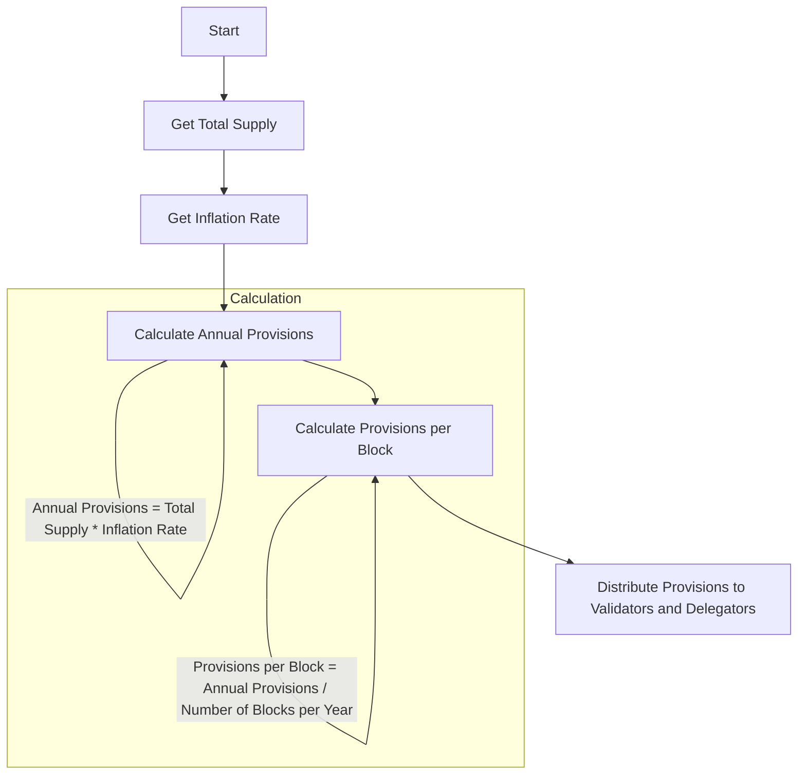
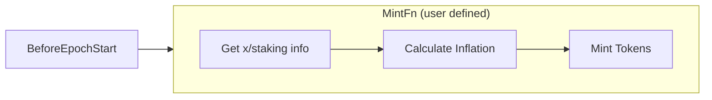

# `x/mint`

## Contents

* [Concepts](#concepts)
    * [The Minting Mechanism](#the-minting-mechanism)
    * [Provisions](#provisions)
        * [Relation to Inflation](#relation-to-inflation)
        * [Usage per Block](#usage-per-block)
        * [Example](#example)
* [State](#state)
    * [Minter](#minter)
    * [Params](#params)
* [Epoch minting](#epoch-minting)
    * [MintFn](#mintfn)
* [Block based minting](#block-based-minting)
    * [Default configuration](#default-configuration)
    * [NextInflationRate](#nextinflationrate)
    * [NextAnnualProvisions](#nextannualprovisions)
    * [BlockProvision](#blockprovision)
* [Parameters](#parameters)
* [Events](#events)
    * [BeginBlocker](#beginblocker)
* [Client](#client)
    * [CLI](#cli)
    * [gRPC](#grpc)
    * [REST](#rest)

## Concepts

### The Minting Mechanism

The minting mechanism was designed to:

* allow for a flexible inflation rate determined by market demand targeting a particular bonded-stake ratio
* effect a balance between market liquidity and staked supply

In order to best determine the appropriate market rate for inflation rewards, a
moving change rate is used.  The moving change rate mechanism ensures that if
the % bonded is either over or under the goal %-bonded, the inflation rate will
adjust to further incentivize or disincentivize being bonded, respectively. Setting the goal
%-bonded at less than 100% encourages the network to maintain some non-staked tokens
which should help provide some liquidity.

It can be broken down in the following way:

* If the actual percentage of bonded tokens is below the goal %-bonded the inflation rate will
   increase until a maximum value is reached
* If the goal % bonded (67% in Cosmos-Hub) is maintained, then the inflation
   rate will stay constant
* If the actual percentage of bonded tokens is above the goal %-bonded the inflation rate will
   decrease until a minimum value is reached

### Provisions

Provisions are the number of tokens generated and distributed in each block. They are directly related to the inflation rate and the current total supply of tokens. The amount of provisions generated per block is calculated based on the annual provisions, which are determined by the inflation rate and the total supply of tokens.

#### Relation to Inflation

The inflation rate determines the percentage of the total supply of tokens that will be added as provisions over a year. These annual provisions are divided by the number of blocks in a year to obtain the provisions per block.

#### Usage per Block

Each block uses a fraction of the annual provisions, calculated as: 

```plaintext
Provisions per block = Annual provisions / Number of blocks per year
```

These provisions are distributed to validators and delegators as rewards for their participation in the network. 


#### Example

For example, if the total supply of tokens is 1,000,000 and the inflation rate is 10%, the annual provisions would be:

Annual provisions = 1,000,000 * 0.10 = 100,000 tokens

If there are 3,153,600 blocks per year (one block every 10 seconds), the provisions per block would be:
Provisions per block = 100,000 / 3,153,600 ≈ 0.0317 tokens per block.

These provisions are then distributed to validators and delegators as rewards.



## State

### Minter

The minter is a space for holding current inflation information and any other data
related to minting (in the `data` field)

* Minter: `0x00 -> ProtocolBuffer(minter)`

```protobuf reference
https://github.com/cosmos/cosmos-sdk/blob/release/v0.52.x/x/mint/proto/cosmos/mint/v1beta1/mint.proto#L11-L29
```

### Params

The mint module stores its params in state with the prefix of `0x01`,
it can be updated with governance or the address with authority.
**Note:** With the latest update, the addition of the `MaxSupply` parameter allows controlling the maximum supply of tokens minted by the module. 
A value of `0` indicates an unlimited supply.

* Params: `mint/params -> legacy_amino(params)`

```protobuf reference
https://github.com/cosmos/cosmos-sdk/blob/release/v0.52.x/x/mint/proto/cosmos/mint/v1beta1/mint.proto#L31-L73
```

## Epoch minting

In the latest release of x/mint, the minting logic has been refactored to allow for more flexibility in the minting process. The `InflationCalculationFn` has been deprecated in favor of `MintFn`. The `MintFn` function is passed to the `NewAppModule` function and is used to mint tokens on the configured epoch beginning. This change allows users to define their own minting logic and removes any assumptions on how tokens are minted.



### MintFn

The `MintFn` function is called at the beginning of each epoch and is responsible for minting tokens. The function signature is as follows:

```go
type MintFn func(ctx context.Context, env appmodule.Environment, minter *Minter, epochId string, epochNumber int64) error
```

How this function mints tokens is defined by the app developers, meaning they can query state and perform any calculations they deem necessary. [This implementation](https://github.com/cosmos/cosmos-sdk/blob/ace7bca105a8d5363782cfd19c6f169b286cd3b2/simapp/mint_fn.go#L25) in SimApp contains examples of how to use `QueryRouterService` and the Minter's `data`.

:::warning
Note that BeginBlock will keep calling the MintFn for every block, so it is important to ensure that MintFn returns early if the epoch ID does not match the expected one.
:::


## Block based minting

In addition to minting based on epoch, minting based on block is also possible. This is achieved through calling the `MintFn` in `BeginBlock` with an epochID and epochNumber of `"block"` and `-1`, respectively.

### Default configuration

If no `MintFn` is passed to the `NewAppModule` function, the minting logic defaults to block-based minting, corresponding to `mintKeeper.DefaultMintFn(types.DefaultInflationCalculationFn)`. 

### Inflation rate calculation

Inflation rate is calculated using an "inflation calculation function" that's
passed to the `NewAppModule` function. If no function is passed, then the SDK's
default inflation function will be used (`NextInflationRate`). In case a custom
inflation calculation logic is needed, this can be achieved by defining and
passing a function that matches `InflationCalculationFn`'s signature.

```go
type InflationCalculationFn func(ctx sdk.Context, minter Minter, params Params, bondedRatio math.LegacyDec) math.LegacyDec
```

#### NextInflationRate

The target annual inflation rate is recalculated each block.
The inflation is also subject to a rate change (positive or negative)
depending on the distance from the desired ratio (67%). The maximum rate change
possible is defined to be 5% per year, however, the annual inflation is capped between 0% and 5%.

```go
NextInflationRate(params Params, bondedRatio math.LegacyDec) (inflation math.LegacyDec) {
	inflationRateChangePerYear = (1 - bondedRatio/params.GoalBonded) * params.InflationRateChange
	inflationRateChange = inflationRateChangePerYear/blocksPerYr

	// increase the new annual inflation for this next block
	inflation += inflationRateChange
	if inflation > params.InflationMax {
		inflation = params.InflationMax
	}
	if inflation < params.InflationMin {
		inflation = params.InflationMin
	}

	return inflation
}
```

### NextAnnualProvisions

Calculate the annual provisions based on current total supply and inflation
rate. This parameter is calculated once per block.

```go
NextAnnualProvisions(params Params, totalSupply math.LegacyDec) (provisions math.LegacyDec) {
	return Inflation * totalSupply
```

### BlockProvision

Calculate the provisions generated for each block based on current annual provisions. The provisions are then minted by the `mint` module's `ModuleMinterAccount` and then transferred to the `auth`'s `FeeCollector` `ModuleAccount`.

```go
BlockProvision(params Params) sdk.Coin {
	provisionAmt = AnnualProvisions/ params.BlocksPerYear
	return sdk.NewCoin(params.MintDenom, provisionAmt.Truncate())
```


## Parameters

The minting module contains the following parameters:
Note: `0` indicates unlimited supply for MaxSupply param

| Key                 | Type             | Example                |
|---------------------|------------------|------------------------|
| MintDenom           | string           | "uatom"                |
| InflationRateChange | string (dec)     | "0.130000000000000000" |
| InflationMax        | string (dec)     | "0.200000000000000000" |
| InflationMin        | string (dec)     | "0.070000000000000000" |
| GoalBonded          | string (dec)     | "0.670000000000000000" |
| BlocksPerYear       | string (uint64)  | "6311520"              |
| MaxSupply           | string (math.Int)| "0"                    |


## Events

The minting module emits the following events:

### BeginBlocker

| Type | Attribute Key     | Attribute Value    |
|------|-------------------|--------------------|
| mint | bonded_ratio      | {bondedRatio}      |
| mint | inflation         | {inflation}        |
| mint | annual_provisions | {annualProvisions} |
| mint | amount            | {amount}           |


## Client

### CLI

A user can query and interact with the `mint` module using the CLI.

#### Query

The `query` commands allows users to query `mint` state.

```shell
simd query mint --help
```

##### annual-provisions

The `annual-provisions` command allows users to query the current minting annual provisions value

```shell
simd query mint annual-provisions [flags]
```

Example:

```shell
simd query mint annual-provisions
```

Example Output:

```shell
22268504368893.612100895088410693
```

##### inflation

The `inflation` command allows users to query the current minting inflation value

```shell
simd query mint inflation [flags]
```

Example:

```shell
simd query mint inflation
```

Example Output:

```shell
0.199200302563256955
```

##### params

The `params` command allows users to query the current minting parameters

```shell
simd query mint params [flags]
```

Example:

```yml
blocks_per_year: "4360000"
goal_bonded: "0.670000000000000000"
inflation_max: "0.200000000000000000"
inflation_min: "0.070000000000000000"
inflation_rate_change: "0.130000000000000000"
mint_denom: stake
max_supply: "0"
```

### gRPC

A user can query the `mint` module using gRPC endpoints.

#### AnnualProvisions

The `AnnualProvisions` endpoint allows users to query the current minting annual provisions value

```shell
/cosmos.mint.v1beta1.Query/AnnualProvisions
```

Example:

```shell
grpcurl -plaintext localhost:9090 cosmos.mint.v1beta1.Query/AnnualProvisions
```

Example Output:

```json
{
  "annualProvisions": "1432452520532626265712995618"
}
```

#### Inflation

The `Inflation` endpoint allows users to query the current minting inflation value

```shell
/cosmos.mint.v1beta1.Query/Inflation
```

Example:

```shell
grpcurl -plaintext localhost:9090 cosmos.mint.v1beta1.Query/Inflation
```

Example Output:

```json
{
  "inflation": "130197115720711261"
}
```

#### Params

The `Params` endpoint allows users to query the current minting parameters

```shell
/cosmos.mint.v1beta1.Query/Params
```

Example:

```shell
grpcurl -plaintext localhost:9090 cosmos.mint.v1beta1.Query/Params
```

Example Output:

```json
{
  "params": {
    "mintDenom": "stake",
    "inflationRateChange": "130000000000000000",
    "inflationMax": "200000000000000000",
    "inflationMin": "70000000000000000",
    "goalBonded": "670000000000000000",
    "blocksPerYear": "6311520",
    "maxSupply": "0",
  }
}
```

### REST

A user can query the `mint` module using REST endpoints.

#### annual-provisions

```shell
/cosmos/mint/v1beta1/annual_provisions
```

Example:

```shell
curl "localhost:1317/cosmos/mint/v1beta1/annual_provisions"
```

Example Output:

```json
{
  "annualProvisions": "1432452520532626265712995618"
}
```

#### inflation

```shell
/cosmos/mint/v1beta1/inflation
```

Example:

```shell
curl "localhost:1317/cosmos/mint/v1beta1/inflation"
```

Example Output:

```json
{
  "inflation": "130197115720711261"
}
```

#### params

```shell
/cosmos/mint/v1beta1/params
```

Example:

```shell
curl "localhost:1317/cosmos/mint/v1beta1/params"
```

Example Output:

```json
{
  "params": {
    "mintDenom": "stake",
    "inflationRateChange": "130000000000000000",
    "inflationMax": "200000000000000000",
    "inflationMin": "70000000000000000",
    "goalBonded": "670000000000000000",
    "blocksPerYear": "6311520",
    "maxSupply": "0",
  }
}
```
